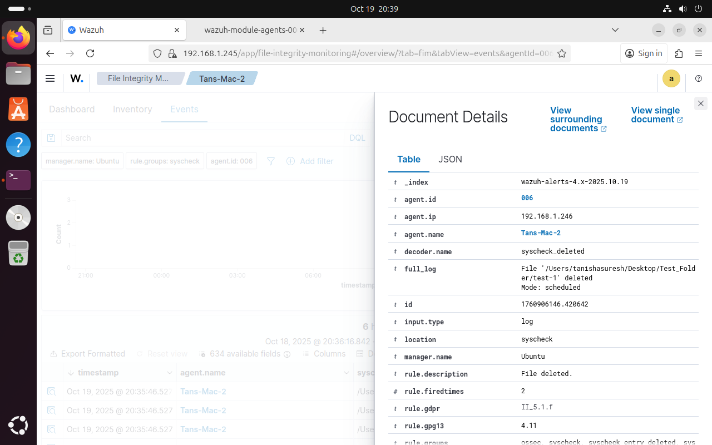
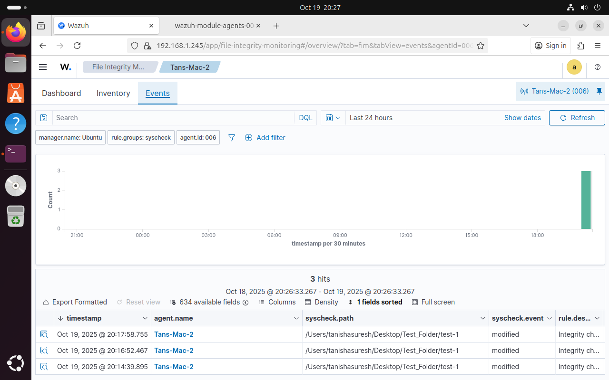

# Wazuh-SIEM-Homelab
Home Lab Series – Lab 2: Wazuh SIEM/XDR home lab with Ubuntu, VirtualBox, and macOS agent, focused on File Integrity Monitoring and security event analysis.

# 🔐 Home Lab Series | Lab 2: SIEM & XDR with Wazuh

This repository documents **Lab 2** of my Home Lab Series, focused on hands-on cybersecurity learning.

In this lab, I built a **SIEM and XDR environment using Wazuh** from scratch to understand how security monitoring, detection, and File Integrity Monitoring (FIM) work in real-world environments.

---

## 🧠 Architecture

**Lab setup:**
- **Wazuh Manager**: Ubuntu VM running on VirtualBox
- **Wazuh Agent**: macOS host system
- **Networking**: Bridged adapter
- **Primary focus**: File Integrity Monitoring (FIM)

---

## 🎯 Objectives

- Build a SIEM/XDR environment using Wazuh
- Understand manager–agent communication
- Configure and validate File Integrity Monitoring
- Analyze alerts using dashboards and Discover view
- Gain practical insight into SOC-style monitoring

---

## 🛠️ Tools & Technologies

- Wazuh (Manager, Agent, Dashboard)
- Ubuntu (Virtual Machine)
- macOS (Agent host)
- VirtualBox

---

## 🚨 File Integrity Monitoring (FIM)

### Alert Analysis (Discover View)

This view shows raw security events generated when monitored files are modified or deleted on the endpoint.

### FIM Dashboard

Provides a visual summary of file integrity events over time, helping identify abnormal activity.

---

## 🖥️ Endpoint Visibility

Shows the macOS endpoint successfully enrolled with Wazuh and actively reporting security events.

---

## 📊 Wazuh Overview

High-level view of alerts, severity distribution, and enabled security modules.

---

## 📚 Key Learnings

- A SIEM is only as effective as the data it receives
- Proper agent configuration is critical for visibility
- File Integrity Monitoring provides strong indicators of system changes
- Dashboards provide context, but raw event analysis enables deeper investigation

---

## 🔮 Next Steps

- Simulate attacks to validate detections
- Map alerts to MITRE ATT&CK techniques
- Tune rules to reduce false positives
- Expand the lab with additional endpoints
